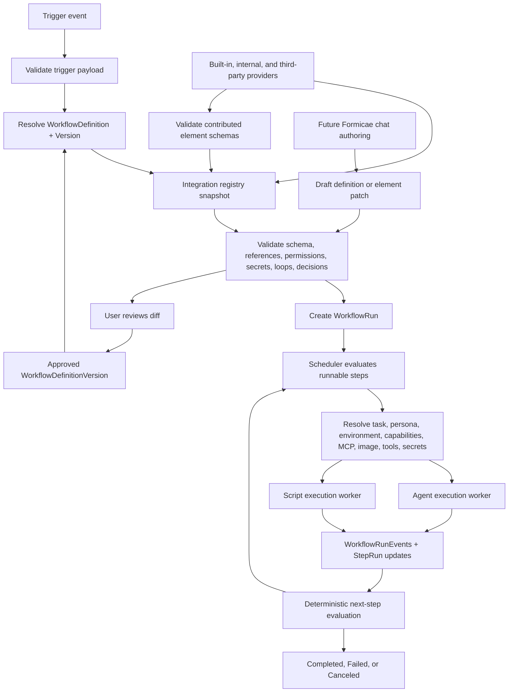

# Configurable Workflows Architecture

Status: planned architecture. This document describes the intended direction for configurable workflows; it does not describe current runtime behavior or commit a final DSL schema.

## Current MVP Relationship

The current MVP workflow is intentionally hardcoded:

```text
Plan -> Implement -> CreatePullRequest -> AddressComments
```

`Plan` waits for the `ready-to-plan` issue label, creates or updates a plan comment, and can rerun when new issue feedback arrives before implementation. `Implement` waits for `ready-to-implement`, creates or reuses the workflow branch, and runs the agent against the approved plan. `CreatePullRequest` opens the PR from the workflow branch. `AddressComments` runs while the PR is open and comments exist, with completed workflows requeued for later review feedback.

Configurable workflows should first model this exact flow as the built-in default. Runtime implementation should remain compatible with the existing static path until configurable definitions are validated, versioned, and persisted on runs.

## Goals

- Define a readable workflow model for agent, integration, and script steps.
- Support the planned capabilities from issues #9 through #22 without forcing all of them into the first runtime slice.
- Keep orchestration concepts in `hhnl.Formicae.Application` and adapter-specific resolution in `hhnl.Formicae.Infrastructure`.
- Make every workflow run reproducible by persisting the selected workflow definition version and resolved integration element versions.
- Allow internal and third-party integrations to contribute tasks, triggers, environments, capabilities, MCP servers, container images, and tool installers through explicit schemas.
- Leave a safe path for future chat-based natural-language authoring without executing unreviewed generated changes.

## Non-Goals

- No runtime DSL parser, database migration, scheduler rewrite, or UI editor is included in this issue.
- No replacement of the current hardcoded MVP workflow is included in this issue.
- No commitment to a final YAML property set or storage format is made here.
- No arbitrary user code should run in the API process as part of workflow definition evaluation.

## Prior Art

| System | Useful pattern | Risk for Formicae |
| --- | --- | --- |
| [GitHub Actions](https://docs.github.com/actions/using-workflows/workflow-syntax-for-github-actions) | YAML workflows, event triggers, reusable workflows, job dependencies, secrets scoped into jobs. | Flexible expression contexts can become hard to validate and can hide runtime-only failures. |
| [Argo Workflows](https://argo-workflows.readthedocs.io/en/latest/workflow-concepts/) | Kubernetes-native steps, DAGs, parallel branches, templates, and conditional execution. | Full CRD-level power would duplicate Formicae orchestration and expose too much Kubernetes complexity to users. |
| [Temporal](https://docs.temporal.io/workflow-definition) | Durable execution, deterministic workflow logic, replay, and explicit workflow versioning. | Code-defined workflows are powerful but would make user-authored workflow review and sandboxing harder. |
| [Airflow DAGs](https://airflow.apache.org/docs/apache-airflow/stable/core-concepts/dags.html) | DAG structure, scheduling concepts, retries, and dependency visibility. | Python-authored DAGs are operationally heavy and oriented toward data pipelines, not reviewed DevOps agent work. |
| [Tekton](https://tekton.dev/docs/pipelines/pipelines/) | Kubernetes-native Pipeline, Task, params, results, workspaces, `when`, and `finally` concepts. | Tekton's pipeline vocabulary is close to CI/CD but not directly aligned with personas, MCP, and agent prompts. |
| [Buildkite](https://buildkite.com/docs/pipelines/configure/defining-steps) | Versioned YAML pipelines, plugins, dynamic uploads, parallelism, and agent pools. | Dynamic pipeline mutation is powerful but should be tightly reviewed before Formicae executes generated changes. |
| [CUE](https://cuelang.org/docs/) | Schema, data, and constraints in one language; strong validation and policy-like checks. | CUE is less familiar than YAML/JSON and would add a new toolchain to the MVP. |
| [Dhall](https://dhall-lang.org/) | Typed, programmable, non-Turing-complete configuration with imports and normalization. | The language is safe but unfamiliar, and user adoption would be harder than a schema-backed YAML shape. |
| [Nix](https://nix.dev/tutorials/nix-language.html) | Reproducible, composable environment definitions and strong content-addressed thinking. | Nix is too broad and too specialized to use directly as the workflow DSL. |

The strongest direction for Formicae is a schema-first declarative DSL with a small deterministic expression language. That borrows GitHub Actions and Buildkite readability, Argo and Tekton structure, Temporal versioning discipline, and CUE-style validation without embedding a general programming language.

## DSL Options

| Option | Strengths | Weaknesses | Recommendation |
| --- | --- | --- | --- |
| YAML/JSON declarative DSL backed by JSON Schema or OpenAPI schema | Familiar, reviewable in PRs, easy to store, easy to generate from chat, works with existing .NET validation libraries. | Needs strict validation and a constrained expression language to avoid ambiguous runtime behavior. | Recommended initial direction. |
| Code-defined workflows | Maximum flexibility and strong host-language tooling. | Hard to review safely, hard to sandbox, and likely to put user code in trusted runtime paths. | Defer. |
| Embedded workflow engine | Mature features for retries, state, workers, and observability. | Adds runtime complexity and can fight Formicae's existing Kubernetes worker model. | Re-evaluate only if the internal scheduler becomes a bottleneck. |
| Typed schema-first languages such as CUE or Dhall | Strong validation, composition, normalization, and reduced duplication. | Less familiar to target users and adds a specialized authoring toolchain. | Consider later as optional authoring frontends that compile to the canonical schema. |

Example shapes in this document are illustrative. They are not committed schema.

## Proposed Core Model

`WorkflowDefinition` is the named workflow contract. It contains stable identity, display metadata, supported triggers, version history, and policy defaults.

`WorkflowDefinitionVersion` is an immutable version of the workflow graph and DSL schema version. It contains steps, edges, decisions, loop bounds, required capabilities, referenced tasks, referenced environments, referenced secrets, and migration metadata.

`WorkflowRun` is one execution instance. It stores the selected `WorkflowDefinition` id, `WorkflowDefinitionVersion` id, DSL schema version, trigger event summary, current state, resolved integration element versions, and terminal outcome.

`WorkflowStep` is a node in the definition graph. It can reference an agent task, script task, integration task, decision, loop, parallel group, or wait state.

`StepRun` is the runtime attempt for a `WorkflowStep`. It records status, attempt number, external job id, selected environment, selected persona, resolved secrets by reference id only, output references, failure reason, and timing.

`WorkflowRunEvent` is the audit stream. It records definition selection, validation outcomes, scheduling decisions, external job assignment, secret reference use without values, step output summaries, cancellation, retry, failure, and completion.

`TaskDefinition` describes reusable work. It includes task kind, input schema, output schema, execution type, prompt template or script reference, idempotency contract, required capabilities, secret requirements, and compatible environments.

`TriggerDefinition` describes how workflow runs are created or requeued. It includes event source, event schema, filter conditions, permission requirements, and deduplication key rules.

`EnvironmentDefinition` describes where work runs. It includes runner class, container image reference, workspace strategy, MCP servers, tool installers, resource requests, network policy profile, and Kubernetes constraints.

`Persona` describes agent behavior. It includes prompt overlays, allowed tools, model defaults, review requirements, and safety constraints.

`CapabilitySet` describes permissions and runtime affordances. Capabilities include repository read, repository write, issue comment, pull request write, Kubernetes job create, MCP server access, tool install, and secret read.

`SecretReference` names a secret without exposing the value. It includes provider type, external secret id, allowed consumers, redaction policy, and audit label.

Ownership boundaries:

- `hhnl.Formicae.Application` owns workflow definitions, versions, runs, steps, step runs, events, validation contracts, deterministic step selection, retries, cancellation, and audit semantics.
- `hhnl.Formicae.Infrastructure` resolves GitHub, Azure DevOps, Kubernetes, secret stores, MCP servers, container images, tool installers, and runner details.
- `hhnl.Formicae.Api` exposes review, CRUD, trigger, and read APIs after the Application layer accepts definitions as valid.
- `hhnl.Formicae.Worker` executes the already-resolved agent or script payload inside the selected environment.

## CRDT Evaluation

Conflict-free replicated data types are worth evaluating for authoring workflows because multiple people, agents, or integration providers may propose changes to the same workflow at the same time. A CRDT-backed draft can merge independent edits such as adding a task, changing a trigger filter, or updating display metadata without forcing every author through a central lock. This is especially relevant for future chat-based authoring, where an agent may create a structured patch while a user or another integration is editing the same draft.

CRDTs are a weaker fit for enabled workflow definition versions. Enabled versions should remain immutable, reviewed, validated artifacts with stable content hashes. The canonical runtime contract should therefore be a validated `WorkflowDefinitionVersion` snapshot, not a live mutable CRDT document. A CRDT draft may compile into that snapshot after validation, review, permission checks, and approval.

Runtime state also should not use CRDTs as the primary source of truth in the first implementation. `WorkflowRun`, `StepRun`, and `WorkflowRunEvent` transitions need deterministic ordering, idempotent scheduling, secret redaction guarantees, and clear failure semantics. An append-only event stream with optimistic concurrency is simpler to audit and reason about. CRDTs may later help with replicated observability views or offline UI edits, but scheduler decisions should be derived from the authoritative persisted event stream and the selected immutable definition version.

Recommended initial position:

- Use immutable `WorkflowDefinitionVersion` snapshots for enabled workflows.
- Consider CRDTs only for draft authoring documents or collaborative workflow editors.
- Compile CRDT drafts into canonical JSON/YAML snapshots before validation and approval.
- Store the CRDT document id and merge metadata as authoring audit data, not as the runtime definition identity.
- Keep runtime state event-sourced or append-only with optimistic concurrency; do not merge concurrent scheduler decisions through CRDT conflict resolution.
- Revisit CRDT-backed runtime state only if Formicae requires multi-primary, disconnected schedulers and can prove deterministic merge semantics for step transitions, retries, cancellations, and secret-scoped work.

## Integration and Extension Architecture

Integrations may contribute workflow elements:

- tasks
- triggers
- environments
- capabilities
- secret reference types
- MCP server definitions
- tool installers
- container images

Every contributed element must include:

- stable id, for example `github.create-pull-request`
- semantic version
- schema for inputs, outputs, and configuration
- display name and description
- validation rules
- required capabilities
- secret requirements by reference type
- compatibility constraints, including Formicae version, DSL schema version, runner type, image architecture, and Kubernetes requirements
- immutable content hashes for contributed schemas, prompts, scripts, images, MCP definitions, and installer manifests
- deprecation metadata when a version is being replaced

Registration can happen at startup from built-in providers, allowlisted configured integration providers, or signed extension metadata packages. Discovery should produce an immutable registry snapshot for each validation pass. A workflow definition may reference only registry elements that exist in that snapshot and pass schema validation. Validation fails before any Kubernetes Job is created.

Third-party providers should not execute arbitrary code in the API process. Metadata alone cannot grant runtime permissions: the workflow owner, provider allowlist, and capability policy must all authorize a contributed element before it can run. Prefer signed metadata packages, provenance records, content hashes, and adapter-owned runtime execution. If executable validation is eventually needed, run it in an isolated worker with strict timeout, network, and secret restrictions.

Each provider should receive only the capabilities explicitly granted to that provider and element version. Tool installers, MCP servers, and custom images are treated as runtime behavior, not passive metadata, and require the same allowlist, signature, hash, and capability checks as tasks.

## Natural-Language Authoring

A future Formicae chat integration can create or modify workflow definitions and custom elements from prompts. It must use a reviewed definition flow:

1. User describes the desired workflow or element.
2. Agent proposes a structured definition or patch.
3. Validator checks schema, known references, permissions, secret references, loop bounds, deterministic branch conditions, integration compatibility, and migration impact.
4. User reviews a diff against the current definition version.
5. Reviewer permissions are checked against added triggers, capabilities, environments, and secret references.
6. Approved changes are saved as a new `WorkflowDefinitionVersion`.

Natural-language generation must never directly execute unreviewed workflow changes. Generated definitions and custom elements remain disabled drafts until validation passes and an authorized user with permission for every added capability approves the diff. The audit trail records the requesting user, proposing agent, validator result, reviewer, approval time, and saved version id.

Examples:

- "Create a reusable task that updates Helm chart docs after deployment files change" produces a draft `TaskDefinition` with inputs, outputs, required repo-write capability, and prompt template.
- "Add a trigger for GitHub issue label `security-review`" produces a draft `TriggerDefinition` with event schema, label filter, and required issue-read permission.
- "Run documentation checks in parallel with implementation" produces a workflow diff that adds a bounded parallel group and updates aggregation semantics.

## DSL Examples

Fragments below omit the common top-level wrapper unless the wrapper is relevant:

```yaml
schema: formicae.workflow/v1alpha1
workflow:
  id: example.workflow
  steps: []
```

Sequential workflow:

```yaml
schema: formicae.workflow/v1alpha1
workflow:
  id: builtins.github-issue-static
  steps:
    - id: plan
      uses: builtins.plan
      next: implement
    - id: implement
      uses: builtins.implement
      next: createPullRequest
    - id: createPullRequest
      uses: builtins.create-pull-request
      next: addressComments
    - id: addressComments
      uses: builtins.address-comments
```

Decision branch:

```yaml
steps:
  - id: classify
    uses: builtins.classify-issue
    next:
      when:
        - if: outputs.classify.kind == 'docs'
          then: updateDocs
        - if: outputs.classify.kind == 'code'
          then: implement
      otherwise: requestClarification
```

Bounded loop:

```yaml
steps:
  - id: revisePlan
    uses: builtins.plan
    repeat:
      until: inputs.issue.hasNewPlanFeedback == false
      maxIterations: 3
    next: implement
```

The repeated step runs once, evaluates `until` after each attempt, exits to `next` when the condition is true, and fails validation if `maxIterations` is missing.

Parallel branches:

```yaml
steps:
  - id: implementationGroup
    parallel:
      branches:
        - id: implement
          uses: builtins.implement
        - id: docsCheck
          uses: builtins.script
          with:
            command: "npm run docs:check"
      aggregate: allSucceeded
    next: createPullRequest
```

Script step:

```yaml
steps:
  - id: markdownLint
    uses: builtins.script
    environment: env.docs
    with:
      shell: sh
      command: "npx markdownlint-cli2 docs/**/*.md"
```

Reusable task:

```yaml
tasks:
  - id: org.update-release-docs
    version: 1.0.0
    type: agent
    inputs:
      changedFiles:
        type: array
        items:
          type: string
    prompt: prompts/update-release-docs.md
```

Per-step persona:

```yaml
steps:
  - id: reviewSecurity
    uses: org.security-review
    persona: personas.security-reviewer
```

Per-step environment:

```yaml
steps:
  - id: runKubernetesSmoke
    uses: builtins.script
    environment: environments.kind-e2e
```

Per-step secrets:

```yaml
steps:
  - id: publishPreview
    uses: org.publish-preview
    secrets:
      - id: previewToken
        ref: secrets.azure-key-vault.preview-token
```

Integration-provided task:

```yaml
steps:
  - id: openPullRequest
    uses: github.create-pull-request@2.1.0
    with:
      titleFrom: outputs.implement.summary
```

Integration-provided trigger:

```yaml
triggers:
  - id: readyToPlan
    uses: github.issue-labeled@1.0.0
    with:
      label: ready-to-plan
      repository: inputs.repositoryUrl
```

## Execution Semantics

Sequential execution runs the next step only after the current step succeeds. A step with no next step completes the workflow unless it is inside a parallel group or loop.

Decisions must be deterministic. Conditions may read trigger payload, workflow inputs, validated step outputs, constants, and selected definition metadata. They may not call network services, read clocks directly, generate random values, or inspect secret values.

Loops must be bounded by `maxIterations` and may also have a timeout. The validator rejects unbounded loops, missing exit branches, and loop conditions that depend on nondeterministic inputs.

Parallel branches run independent step subgraphs. Aggregation policies should start with `allSucceeded`, `anySucceeded`, and `collectFailures`. Parallel outputs are namespaced by branch id.

Script steps run command payloads in a resolved worker environment. Agent steps render prompts and run the configured agent runner. Both are represented as `StepRun` records and emit the same audit events.

Retries are configured per task or step. Retry policies include maximum attempts, retryable failure categories, and backoff. Retried steps must either be idempotent or declare compensation and output overwrite behavior.

Cancellation sets the run and active step runs to canceling, asks infrastructure to stop external jobs, and records cancellation events. A canceled run does not schedule new steps.

Failure handling starts with fail-fast. Later versions may add `onFailure`, `finally`, or compensation steps, but those should be explicit graph nodes rather than implicit hidden execution.

Audit events are append-only. They record validation, selected versions, step state transitions, external job ids, retry decisions, and failure categories. Secret values are never emitted.

## Upgradeability and Versioning

Workflow definitions are versioned independently from the DSL schema. A run stores:

- workflow definition id
- workflow definition version id
- DSL schema version
- immutable integration registry snapshot id
- selected task, trigger, environment, persona, capability, MCP, image, tool, and secret reference versions
- content hashes for every selected element schema, prompt, script, image, MCP definition, and installer manifest

In-flight runs continue on the definition version they started with. New runs use the latest enabled version unless a trigger or API request selects another enabled version.

Compatible changes may add optional fields with defaults, add new task versions, add new trigger versions, or deprecate unused fields. Breaking changes require a new DSL schema version or an explicit migration. Migrations must be pure transformations from one validated definition shape to another and must preserve audit history.

Deprecated integration element versions remain loadable for historical runs until all dependent runs and retained audit views no longer require them. Removing a version that is still referenced by retained runs is invalid. A registry snapshot is replayable only when all referenced metadata hashes still match; otherwise the run remains inspectable but cannot be retried from that historical snapshot.

If collaborative authoring uses CRDT-backed drafts, the saved `WorkflowDefinitionVersion` still records the compiled canonical snapshot and content hash. Later CRDT merges create a new draft head and must pass the same validation and approval flow before producing another enabled version. In-flight runs never observe draft merges or partially merged workflow changes.

Example schema evolution:

```yaml
# v1alpha1
steps:
  - id: implement
    uses: builtins.implement
    retry: 2
```

```yaml
# v1alpha2 loaded with defaulting
steps:
  - id: implement
    uses: builtins.implement
    retry:
      maxAttempts: 2
      backoff: fixed
```

The v1alpha1 definition still loads because the migration/defaulting rule expands numeric `retry` into the v1alpha2 object without changing execution intent.

## Issues #9-#22 Coverage

| Issue | Capability | Architecture status | Runtime status | Architecture note |
| --- | --- | --- | --- | --- |
| #9 | Loops | Supported | Deferred | Bounded loops with deterministic conditions and maximum iteration counts. |
| #10 | Parallel execution | Supported | Deferred | Parallel branch groups with explicit aggregation policies. |
| #11 | Decisions and branches | Supported | Deferred | Deterministic expression language over validated inputs and outputs. |
| #12 | Scriptable steps | Supported | Deferred | Script steps run in worker environments and share `StepRun` semantics. |
| #13 | Triggers | Supported | Deferred | `TriggerDefinition` plus integration-provided trigger elements. |
| #14 | Personas | Supported | Deferred | Per-step persona references with validation and capability constraints. |
| #15 | Custom tasks | Supported | Deferred | `TaskDefinition` supports built-in, internal, and integration-provided tasks. |
| #16 | Capabilities | Supported | Deferred | `CapabilitySet` validates permissions and runtime affordances before scheduling. |
| #17 | Per-step environments | Supported | Deferred | Each step can reference an `EnvironmentDefinition`. |
| #18 | Per-step secrets | Supported | Deferred | Secret references are scoped per step and redacted everywhere. |
| #19 | Customizable environments | Supported | Deferred | Environments can include images, tools, MCP servers, resources, and policies. |
| #20 | MCP servers | Supported | Deferred | MCP server definitions are environment elements validated before use. |
| #21 | Custom images | Supported | Deferred | Container images are versioned environment elements with compatibility constraints. |
| #22 | Tool installs | Supported | Deferred | Tool installers are declared environment elements with schemas and capability requirements. |

All are architecture-supported. Runtime implementation order remains deferred and should be split into focused issues.

## Security and Validation Rules

- Reject unknown step, task, trigger, environment, persona, capability, MCP server, image, tool, and secret references.
- Reject integration elements that do not pass schema validation.
- Reject unbounded loops.
- Reject nondeterministic branch and loop conditions.
- Reject definitions whose required capabilities exceed the workflow owner's permissions.
- Reject secret references outside the selected step's allowed scope.
- Inject secrets only into the selected worker step that requested them; do not include secret values in workflow definitions, prompts, scheduler payload summaries, or reusable task metadata.
- Redact and scan step outputs, events, logs, API responses, worker payload summaries, generated PR comments, and UI surfaces before persistence or display.
- Constrain network access for steps that receive secrets, including MCP server and tool installer access, so secrets are not exposed to unapproved destinations.
- Record audit events when secret references are resolved and when a secret-scoped step starts, without recording secret values.
- Store only secret reference ids in workflow definitions, step runs, and events.
- Validate all workflow definitions before saving an enabled version.
- Revalidate the selected definition version and integration registry snapshot before run creation.
- Fail before Kubernetes Job creation when configuration is invalid.
- Record validation failures as audit events when tied to a run or authoring action.

## Architecture Diagram



## Migration Strategy

1. Keep the current hardcoded MVP workflow as the built-in default.
2. Introduce workflow definitions as read-only metadata that can represent the current default.
3. Persist definition id and version id on each new `WorkflowRun`.
4. Persist immutable registry snapshot identifiers, resolved element versions, and content hashes on each run.
5. Move `Plan`, `Implement`, `CreatePullRequest`, and `AddressComments` into built-in `TaskDefinition` records.
6. Add validation-only APIs for draft definitions.
7. Add runtime interpretation for a narrow sequential subset.
8. Add decisions, bounded loops, parallel groups, and script steps incrementally.
9. Add editing UI and natural-language authoring only after validation, versioning, and review flows are reliable.

Deferred work includes database migrations, full runtime implementation, authoring UI, chat integration, third-party package signing, and custom executable validators.

## Review Feedback Incorporated

Subagent review challenged the draft on provider trust boundaries, reproducibility, secret exfiltration, DSL consistency, loop clarity, natural-language approval auditability, and issue coverage wording.

The document now requires provider allowlisting, signatures, provenance, content hashes, per-provider capability scoping, immutable registry snapshots, exact resolved element versions, secret injection boundaries, output scanning, network constraints for secret-scoped work, audited generated-definition approval, normalized DSL fragments, clearer bounded loop semantics, and separate architecture/runtime status for #9 through #22.

Pull request review also requested evaluating CRDTs for workflow definitions and runtime state. The document now treats CRDTs as a possible collaborative draft-authoring mechanism, but keeps enabled workflow versions immutable and runtime state append-only until deterministic merge semantics are proven.

## Open Decisions

- Exact DSL schema and expression language.
- Whether canonical storage is YAML, JSON, normalized database rows, or compiled snapshots produced from CRDT-backed drafts.
- Whether CUE or Dhall should be supported as optional authoring frontends.
- How integration metadata packages are signed and distributed.
- Whether custom validators are metadata-only, WebAssembly, worker-executed containers, or not supported.
- How much of the workflow graph should be editable in the first UI slice.
- Retention period for old integration element versions required by historical runs.
- Whether CRDTs are useful enough for collaborative draft authoring to justify the extra storage, validation, and merge-audit complexity.
