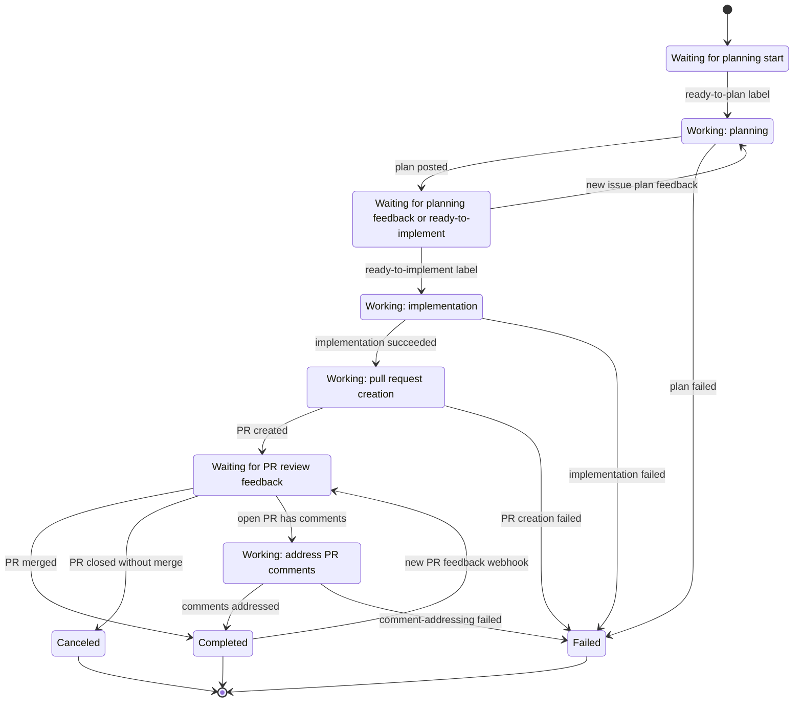

# MVP Workflow

The MVP workflow is intentionally static so agents can understand and test it quickly.
Configurable workflows are planned separately in [Configurable Workflows Architecture](configurable-workflows-architecture.md); that document maps the static MVP flow to the future definition model without changing the current behavior described here.

## Trigger

`POST /api/workflows/github-issue` creates a workflow from:

- `issueUrl`
- `repositoryUrl`
- `baseBranch`
- `model`

The workflow starts in `Queued` with `CurrentStep = None`. The API background orchestrator monitors the work item provider under a PostgreSQL distributed lock and advances phases only when the issue has the expected labels: `ready-to-plan` starts planning, and `ready-to-implement` starts implementation after a plan exists.

## State Machine

## Task Runs

Each agent or integration step is stored as a task run:

- `Plan`: fetches GitHub issue context and asks OpenHands to produce an implementation plan.
- `Implement`: creates or reuses a branch and asks OpenHands to apply the plan.
- `CreatePullRequest`: opens a pull request for the branch.
- `AddressComments`: for an open pull request with comments, asks the agent to address issue comments and review comments from the PR. For Codex subscription jobs, Formicae checks out the workflow branch first and performs the authenticated commit/push after the agent finishes. On success, Formicae posts a new marked top-level PR summary comment.

Completed task runs are reused on retry. This makes workflow advancement idempotent at the step level.
The diagram uses logical states to distinguish waiting from active work. Persisted `WorkflowStatus` and `CurrentStep` are coarser: `PlanningWork` is `Planning` / `Plan` with a running `Plan` task run; `WaitingForPlanningFeedback` is persisted as `Implementing` / `Implement` with a succeeded `Plan` task run and no `ready-to-implement` label yet; `ImplementingWork` is the same persisted status/step with a queued or running `Implement` task run. `WaitingForReviewFeedback` and `AddressingCommentsWork` are both persisted as `Reviewing` / `AddressComments`; the active state is identified by a running `AddressComments` task run.
Agent tasks are scheduled asynchronously. Starting a planning, implementation, or comment-addressing task creates or reuses an external Kubernetes worker Job, records its external id on the task run, and lets the orchestration loop continue processing other runnable workflows instead of waiting for that Job to finish. The worker runs the agent inside its own container, streams supported JSON agent messages back to the API through `/api/worker/agent-messages`, and keeps Kubernetes pod logs as the durable fallback. The API polls running task runs on later ticks, and the Kubernetes job runner also signals the orchestrator when a watched Job completes, fails, or times out so completion is picked up promptly.

If users respond to the issue plan before implementation starts, Formicae treats non-automation issue comments newer than the last successful plan as plan feedback while it is logically in `WaitingForPlanningFeedback`. The workflow schedules another planning run before implementation, includes the previous plan and the newer issue comments in the prompt, updates the existing marked plan comment, and posts a separate marked summary comment describing that the plan was revised. Formicae reacts to the issue when a planning run starts; individual planning-feedback comments are not currently reacted to separately.
After PR creation, the workflow remains in `Reviewing` while the pull request is open. On each review tick, Formicae first reads the pull request status: a merged PR transitions the workflow to `Completed`, and a closed-unmerged PR transitions it to `Canceled`. Open pull requests continue through comment monitoring. Comment monitoring reads both top-level PR issue comments and inline review comments, but ignores comments containing the hidden `<!-- formicae:... -->` marker so automation comments are not treated as user feedback even when the same account is used. When comments are found, the API orchestrator runs `AddressComments`; a successful run posts the summary comment and completes the workflow, and a failed run marks the workflow `Failed`. Completed workflows can be requeued to `Reviewing` by later PR feedback webhooks, so additional review rounds are still processed without keeping an idle open PR permanently runnable.

Later pull request comment or review webhooks requeue a completed workflow for another `AddressComments` pass when there are comments newer than the previous successful pass and the PR is still active. Pull request webhooks also wake the workflow loop promptly when a PR is closed. Merged PR webhooks can complete the workflow immediately; closed-unmerged PRs are canceled by the next review tick after Formicae reads the PR status. Only newer comments are reacted to as started and listed as comments to address. The full pull request conversation is written to `pull-request-conversation.md`, mounted in the agent container at `/workspace/formicae/context/pull-request-conversation.md`, and referenced from the prompt so the agent can pull in more context when needed.

## Local Iteration

Fake adapters are the default. They let tests and local API runs complete the whole workflow without GitHub credentials, Kubernetes, OpenHands, or PostgreSQL.

Use real adapters only after the local vertical slice is passing.
