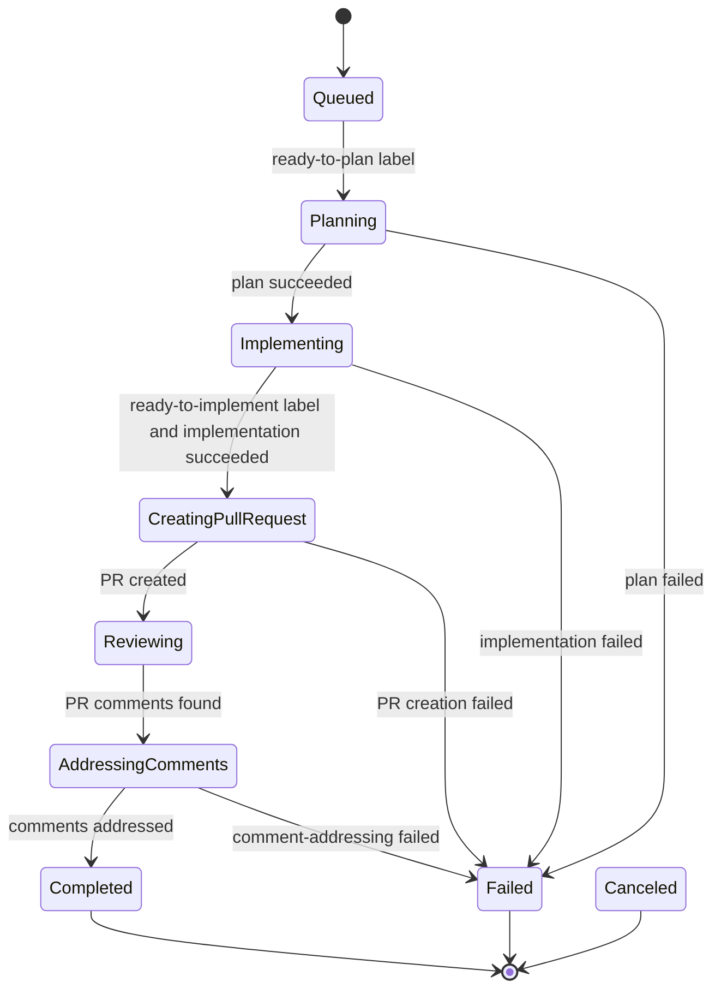

# MVP Workflow

The MVP workflow is intentionally static so agents can understand and test it quickly.

## Trigger

`POST /api/workflows/github-issue` creates a workflow from:

- `issueUrl`
- `repositoryUrl`
- `baseBranch`
- `model`

The workflow starts in `Queued` with `CurrentStep = None`. The API background orchestrator monitors the work item provider under a PostgreSQL distributed lock and advances phases only when the issue has the expected labels: `ready-to-plan` starts planning, and `ready-to-implement` starts implementation after a plan exists.

## State Machine

## Task Runs

Each agent or integration step is stored as a task run:

- `Plan`: fetches GitHub issue context and asks OpenHands to produce an implementation plan.
- `Implement`: creates or reuses a branch and asks OpenHands to apply the plan.
- `CreatePullRequest`: opens a pull request for the branch.
- `AddressComments`: once the pull request has comments, asks the agent to address issue comments and review comments from the PR. For Codex subscription jobs, Formicae checks out the workflow branch first and performs the authenticated commit/push after the agent finishes. On success, Formicae posts a new marked top-level PR summary comment.

Completed task runs are reused on retry. This makes workflow advancement idempotent at the step level.
Agent tasks are scheduled asynchronously. Starting a planning, implementation, or comment-addressing task creates or reuses the external Kubernetes Job, records its external id on the task run, and lets the orchestration loop continue processing other runnable workflows instead of waiting for that Job to finish. The API polls running task runs on later ticks, and the Kubernetes job runner also signals the orchestrator when a watched Job completes, fails, or times out so completion is picked up promptly. `AddressingComments` is shown as a diagram phase for readability; in persisted workflow state this is `Reviewing` with `CurrentStep = AddressComments`.

After PR creation, the workflow remains in `Reviewing` until pull request comments exist. Comment monitoring reads both top-level PR issue comments and inline review comments, but ignores comments containing the hidden `<!-- formicae:... -->` marker so automation comments are not treated as user feedback even when the same account is used. When comments are found, the API orchestrator runs `AddressComments`; a successful run completes the workflow, and a failed run marks the workflow `Failed`.

Later pull request comment or review webhooks requeue the completed workflow for another `AddressComments` pass when there are comments newer than the previous successful pass. Only those newer comments are reacted to as started and listed as comments to address. The full pull request conversation is written to `pull-request-conversation.md`, mounted in the agent container at `/workspace/formicae/context/pull-request-conversation.md`, and referenced from the prompt so the agent can pull in more context when needed.

## Local Iteration

Fake adapters are the default. They let tests and local API runs complete the whole workflow without GitHub credentials, Kubernetes, OpenHands, or PostgreSQL.

Use real adapters only after the local vertical slice is passing.
