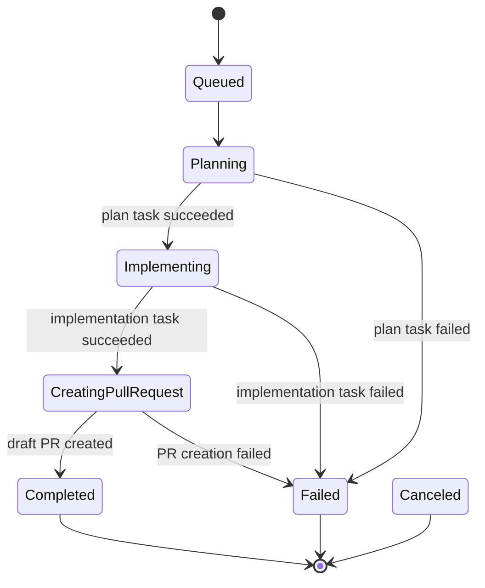

# MVP Workflow

The MVP workflow is intentionally static so agents can understand and test it quickly.

## Trigger

`POST /api/workflows/github-issue` creates a workflow from:

- `issueUrl`
- `repositoryUrl`
- `baseBranch`
- `model`

The workflow starts in `Queued` with `CurrentStep = None`.

## State Machine

## Task Runs

Each agent or integration step is stored as a task run:

- `Plan`: fetches GitHub issue context and asks OpenHands to produce an implementation plan.
- `Implement`: creates or reuses a branch and asks OpenHands to apply the plan.
- `CreatePullRequest`: opens a draft pull request for the branch.

Completed task runs are reused on retry. This makes workflow advancement idempotent at the step level.

## Local Iteration

Fake adapters are the default. They let tests and local API runs complete the whole workflow without GitHub credentials, Kubernetes, OpenHands, or PostgreSQL.

Use real adapters only after the local vertical slice is passing.
